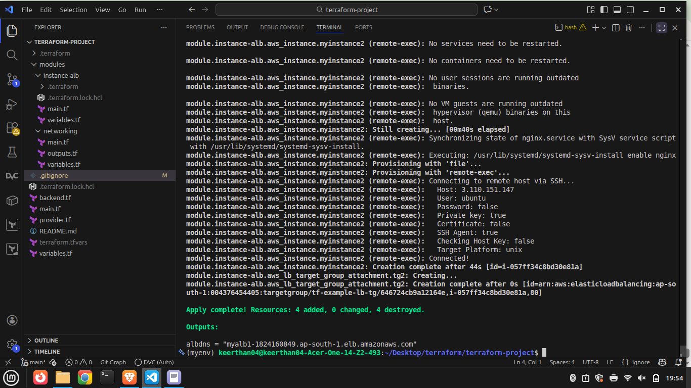
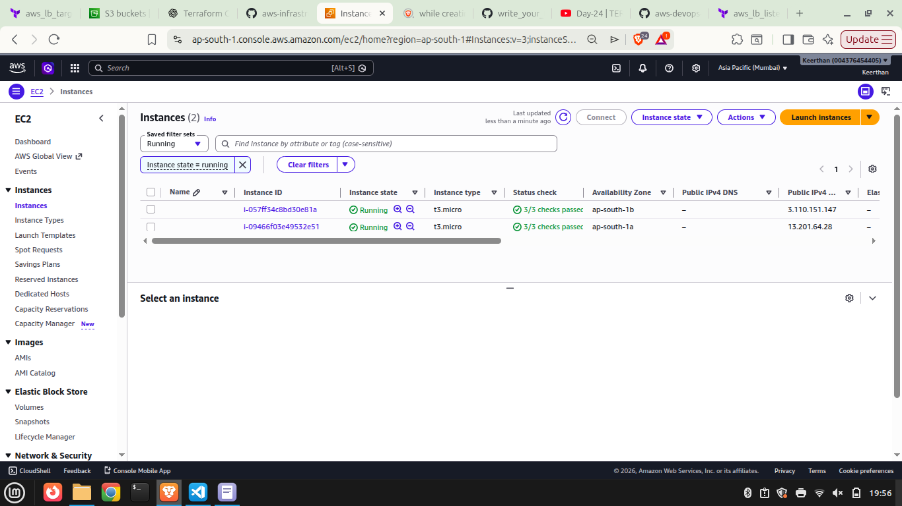
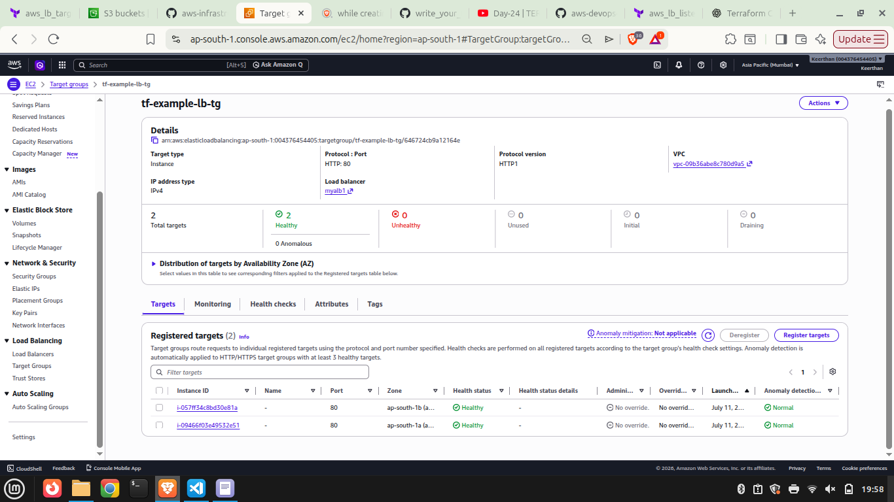
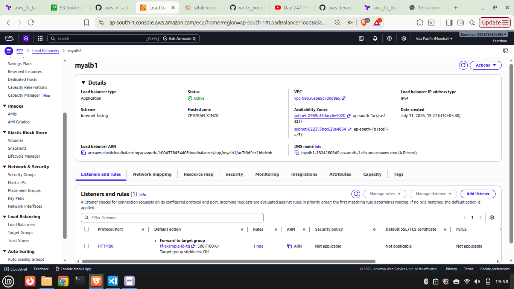

# AWS INFRASTRUCTURE USING TERRAFORM

## Overview

This project provisions a highly available web infrastructure on AWS using Terraform. It creates a custom VPC, public networking components, two EC2 instances, and an Application Load Balancer (ALB) to distribute incoming HTTP traffic between the instances. Terraform **file** and **remote-exec** provisioners are used to automate the installation and configuration of Nginx on each EC2 instance, as well as deploy custom web pages without requiring any manual server setup.

## Architecture

```
                   Internet
                       │
                       ▼
        Application Load Balancer (ALB)
                 HTTP : 80
               ┌────────────┐
               │            │
               ▼            ▼
        EC2 Instance 1   EC2 Instance 2
          Nginx Server     Nginx Server
               │            │
               └──────┬─────┘
                      │
                     VPC
      ┌──────────────────────────────────┐
      │      Public Subnet 1             │
      │      Public Subnet 2             │
      │                                  │
      │ Internet Gateway                 │
      │ Route Tables                     │
      │ Security Groups                  │
      └──────────────────────────────────┘
```
---


## Project Structure

```
terraform-project/
│
├── backend.tf
├── provider.tf
├── main.tf
├── variables.tf
├── terraform.tfvars
├── outputs.tf
├── README.md
│
├── modules/
│   ├── networking/
│   │   ├── main.tf
│   │   ├── variables.tf
│   │   └── outputs.tf
│   │
│   └── instance-alb/
│       ├── main.tf
│       └── variables.tf
│
└── .gitignore
```

---
## Technologies Used

- Terraform
- AWS EC2
- AWS VPC
- AWS S3 (Remote Backend: To store terraform statefile) 
- AWS Application Load Balancer
- Target Groups
- Security Groups
- Internet Gateway
- Route Tables
- Ubuntu
- Nginx

---

## Resources Created


### Networking

- VPC
- Internet Gateway
- Public Route Table
- Public Subnet 1
- Public Subnet 2
- Security Group
The above resources are created in modules/networking

### Compute and Loadbalancing

- EC2 Instance 1
- EC2 Instance 2


- Application Load Balancer
- Target Group
- Listener
- Target Group Attachments
The above resources are created in modules/instance-alb

---

## Prerequisites

- AWS Account
- AWS CLI configured
- Terraform

```bash
aws configure
```

---

## Terraform Commands

### Initialize

```bash
terraform init
```

### Validate

```bash
terraform validate
```

### Preview

```bash
terraform plan
```

### Deploy

```bash
terraform apply
```

### Destroy Infrastructure

```bash
terraform destroy
```

---

## Output

After successful deployment Terraform prints:

```
alb_dns = myalb-xxxxxxxx.ap-south-1.elb.amazonaws.com
```

Open the DNS in your browser:

```
http://<alb_dns>
```

Refreshing the page alternates between the two Nginx servers because the ALB distributes traffic across both EC2 instances.

---


## Results
### Terraform Apply



### EC2 Instances



### Target Group Healthy



### Application Load Balancer


---

## Learning Outcomes

This project demonstrates:

- Infrastructure as Code (IaC)
- Remote Provisioners
- Terraform Modules
- Variable Management
- Resource Dependencies
- AWS Networking
- EC2 Provisioning
- Load Balancing
- High Availability Concepts

---

## Author

**Keerthan**

GitHub: https://github.com/Keerthan2006
